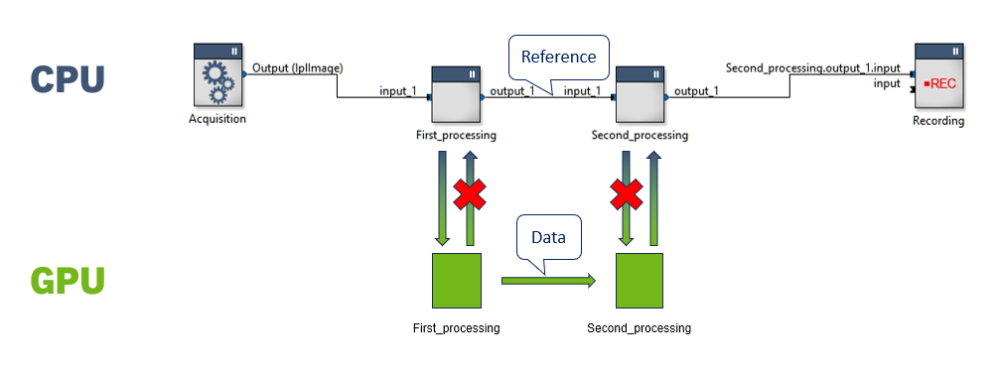

# Introduction

This repository contains sample RTMaps components that use the [CUDA](https://developer.nvidia.com/cuda-toolkit) GPU-accelerated computing technology. Based on this example, you can write RTMaps components that execute your code on the GPU for maximum performance.

More specifically, this sample illustrates exchanging CUDA objects on the inputs and outputs of RTMaps components without having to transfer them to main memory. It is a minimal version of the following example:



RTMaps and its components run on the CPU, and thus use the main memory (RAM) rather than the GPU memory. However, it is possible to use the GPU from C++ code running on the CPU. In that context, it is often necessary to exchange GPU objects between components, which can be done in two ways:
1. "Downloading" the object from GPU to CPU (i.e. make it usable in the CPU): This requires copying data from GPU to main memory. This can be useful for example when you need to process the data on the CPU, record it or send it over the network
2. Leave the object on the GPU and pass only references to it between RTMaps components: This is possible if you don't need the data in the main memory. An example use case is connecting two components that process data on the GPU. As no memory transfer is necessary, this is more efficient and saves resources compared to the first approach. In the example illustrated above, this approach eliminates data transfers marked with a red X.

The first approach does not require advanced RTMaps programming, but only CPU / GPU conversion operations. This sample is concerned with the second approach, were special care must be taken with allocation, handling, and deallocation of GPU objects. The component's output data type is defined as a **Custom Dynamic Structure** and it uses the `dynamic_output` pattern to this end. Please refer to this pattern in [maps_dynamic_custom_struct_component.hpp](src/common/maps_dynamic_custom_struct_component.hpp) for details on how to use dynamic structures on your component's output.

This sample also uses RAII wrappers around the inputs and outputs of RTMaps components. Please refer to https://support.intempora.com/hc/en-us/articles/360007881874 for details on those wrappers.

This sample is structured as follows:
* A **producer** component runs a custom CUDA kernel to build GPU objects (images) then sends it through its output
* A **consumer** component receives the data on its input and prints a part of it on the RTMaps Console

Please note that this project has not been officially released as part of RTMaps yet. However, it has undergone testing so we believe it is usable. Please get in touch with your local Intempora representative if you run into a problem.

# Contents

*  `cuda_component_sample.u/`
	* `README.md`: This file
	* `CMakeLists.txt`: Cross platform build configuration to build the example. See https://support.intempora.com/hc/en-us/articles/360021738293 for more details on using CMake with the RTMaps SDK
	* `rtmaps_package.pckinfo`: General information about the package, including the version number
	* `test/`: Sample RTMaps diagram
	* `src/`: Source code for the project as well as the example
		* `producer/`: Source code for the producer sample component (header, cpp, cuda kernel)
		* `consumer/`: Source code for the consumer sampler component (header, cpp)
		* `common/`: Source code that is common to both the producer and the consumer
			* `my_cuda_struct.h`: Definition of the example's particular Dynamic Custom Structure that holds a reference to the CUDA object. This is the most important file
			* `maps_dynamic_custom_struct_component.hpp`: Dynamic Custom Structure output helper, from the "dynamic_input" pattern


# Prerequisites

To build and use the RTMaps components in this repository, you will need the following:
*  A Windows or Linux PC with an x86_64 architecture CPU and a CUDA-compatible GPU. The RTMaps components have been tested on Windows 10 and Ubuntu 22.04. Virtual machines are not supported.
*  RTMaps.
*  A C++ compiler:
   *  In Linux, you can install one with the command `sudo apt install build-essential`.
   *  In Windows, Microsoft Visual C++ is required. These components have been tested with Visual C++ 2019.
   *  For more details, see [C++ Compiler prerequisite](https://support.intempora.com/hc/en-us/articles/360021738293#c-compiler).
*  CMake.
*  The [CUDA toolkit](https://developer.nvidia.com/cuda-downloads).

# Getting started

You can start by reading the code for Custom Dynamic Structure that is exchanged between the components. It is the `MyCudaStruct` structure that is located in the `cuda_component_sample.u/src/common/my_cuda_struct.h` file.

The important parts of the process are on the **producer**'s side:

*  Notice that the constructor calls the `allocateMemory()` method that, in turns, allocates GPU memory with `cudaMalloc()`.
*  As explained in the `dynamic_input` pattern, the constructor for your output object is called once for each of your FIFO output buffer slots (of which there are 16 by default) at the beginning of the run. More specifically, this happens in the `dynamic_input` pattern-provided `AllocateDynamicOutputBuffers()` method. Notice that you can initialize your object however you want to. Here, we pass a number of points to the constructor.
*  The `Core()` method calls the `ProcessData()` function that opens a `MAPSIOElt` for writing. It contains one of the previously constructed objects, which means that it contains allocated GPU memory. The component then calls the custom CUDA kernel that writes into the GPU memory.

The consumer code is relatively simple: It is actually the same as the code that is used for reading a legacy non-Dynamic-Custom-Structure.

# Building

This sample builds using CMake. Please follow the instructions on [Developing RTMaps Components Using CMake](https://support.intempora.com/hc/en-us/articles/360021738293) to build the components. CUDA should be found automatically by CMake.

Note: in Windows, the build has been tested with Visual Studio 2019. In our tests, the Visual Studio 2019 solution generated by CMake could only be loaded in Visual Studio 2019 and not e.g. in Visual Studio 2022.

# Testing

Once you have built the RTMaps package, you can run the sample diagram located in the `test` folder. When you open the diagram, RTMaps will report a missing file because it doesn't know in which folder your package has been built. Please click Update. In the window that opens, select the pck line and click Replace in the right pane. Navigate to your package (the build console output should have reported its location) and select it. Then select the rtd line and click Overwrite. Click Run (in the bottom of the window).

When you run the diagram, you should see the following in the RTMaps console:
```
Info: component MyCudaStructProducer_1: Allocating output [o_dynamic_struct] of type [struct MyCudaStruct]
```
followed by 16 lines corresponding to the allocation of the 16 MyCudaStruct instances in the MyCudaStructProducer component's output buffer. These lines should look like:
```
Info: New MyCudaStruct [this:000000001BD07A30] (nbPoints:65536, points:0000000202600000)
```
Each MyCudaStruct instance contains a `points` variable, a pointer to the GPU memory allocated with CUDA. Notice that its value is different for each instance.

While the diagram runs, the MyCudaStructProducer component provides the MyCudaStruct instances on its output. This output is then read by the MyCudaStructConsumer component. Since MyCudaStruct only contains a pointer to GPU data, the data itself isn't "downloaded" from GPU to CPU and back.

When you shut the diagram down, you can see the memory being deallocated for each MyCudaStruct instance:
```
Info: component MyCudaStructProducer_1: Freeing output [o_dynamic_struct] of type [struct MyCudaStruct]
Info: Delete MyCudaStruct [this:000000002825F870] (nbPoints:65536, points:0000000203A00000)
Info: Delete MyCudaStruct [this:000000002825F8B0] (nbPoints:65536, points:0000000203C00000)
...
```
